# IniestaDavid_ASIX1_0373_RA1_A1-Midocumentaci-n
# APUNTES LENGUAJE DE MARCAS


# GitHub:


## Como crear un repositorio en github:

1. El primer paso, sera ir a la pestaña de repositorios y darle a new.

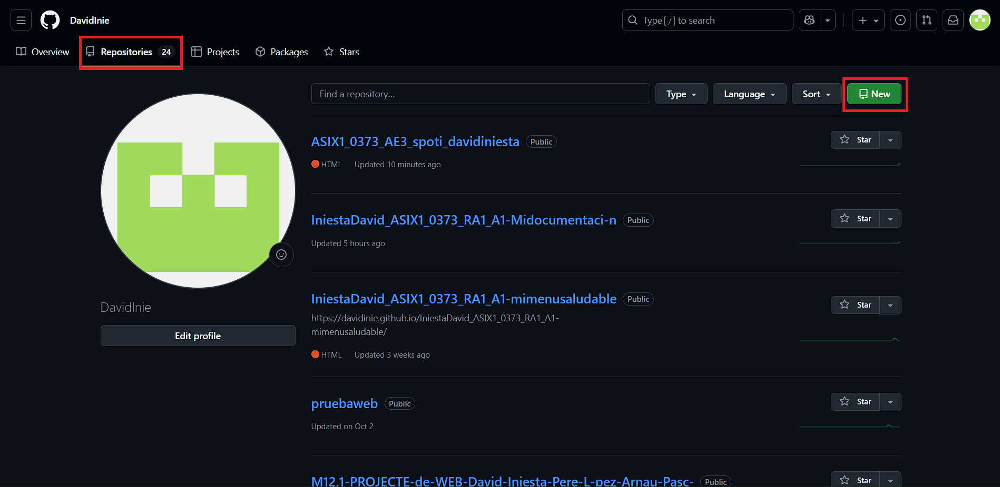

2. El segundo paso, es poner el nombre, descripción y coger la opción de repo publico y pibrado.

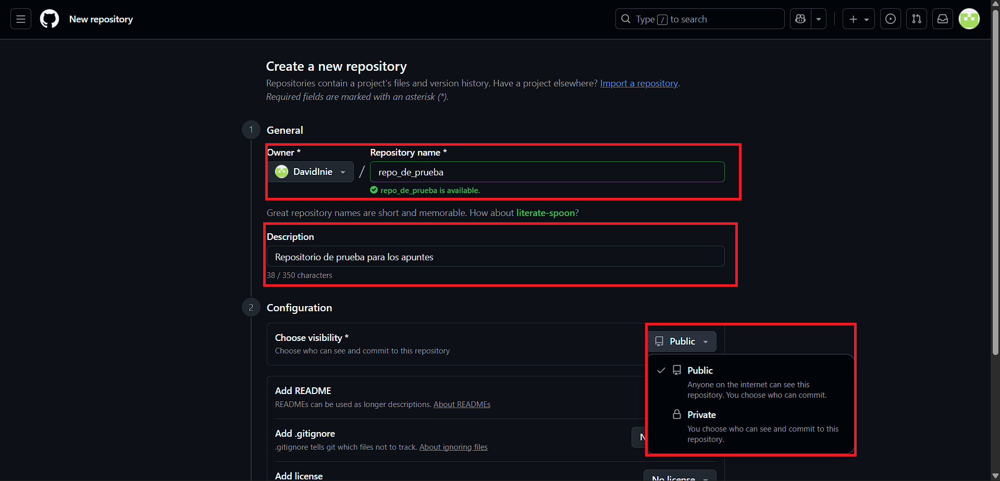

3. Una vez hecho eso los pasos, tendremos que marcar la opción de Add README.

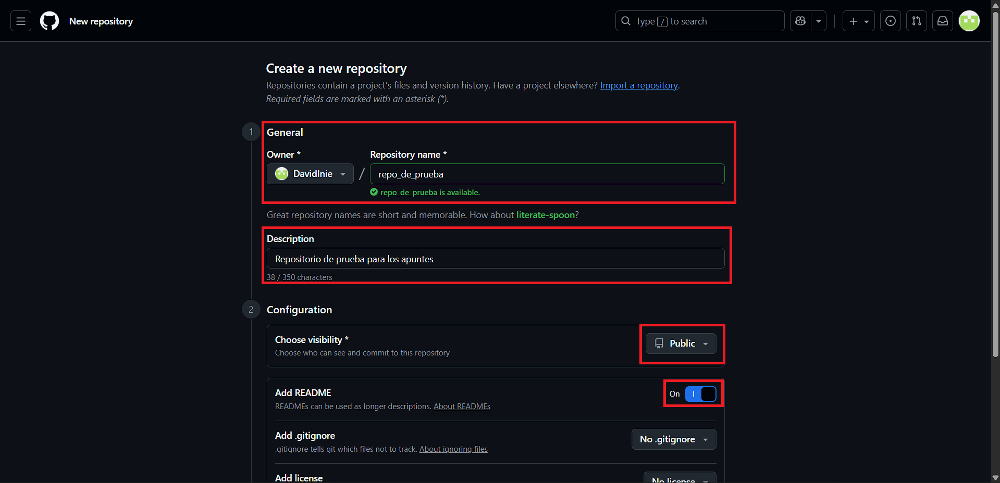

4. Una vez marcada la opción, le daremos a crear reposositorio y ya tendremos creado el repositorio.


## Como hacer un commit a github desde linea de comandos.

1. El primer paso, es entrar a github y coger el enlace de html.

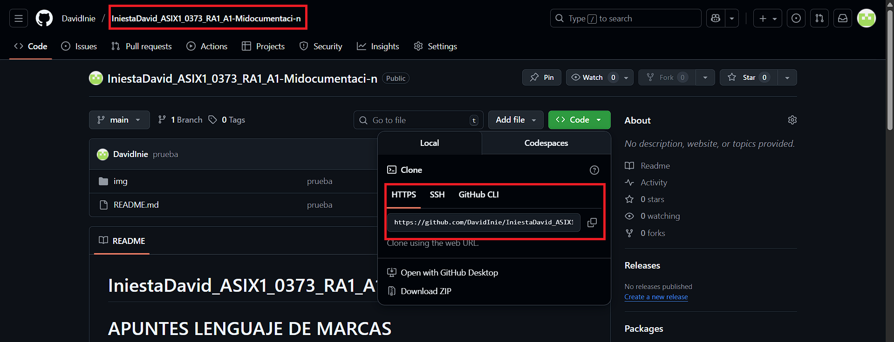

2. Una vez copiado el enlace, iremos a la carpeta del repositorio y abriremos el cmd.

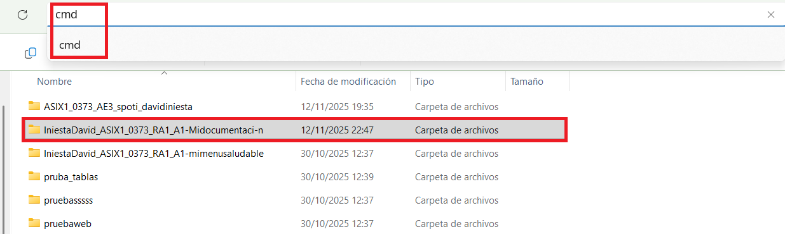

3. Una vez abierto el cmd ejecutaremos el comando (git clone "enlace del repostioria HTML")

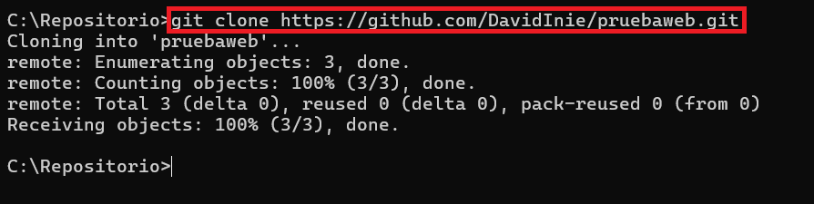

4. Cuando hayamos clonado el repositorio, tendremos que abir el cmd dentro de la carpeta del repositorio.

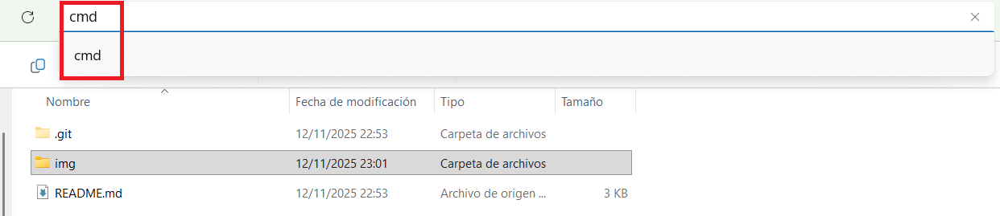

5. Una vez ejecutado el git clone, haremos estos pasos; 1.git init 2.git add . 3.git commit -m "nombre que queremos que tenga el commit" 4.git push origin main.

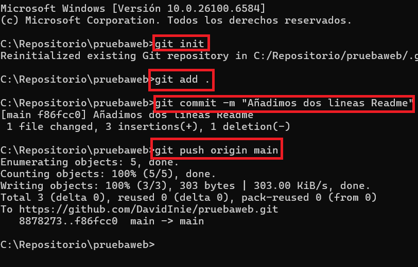


## Como hacer github pages:

1. El primer paso, es ir a la pestaña de repositorios, y entrar al repositorio.

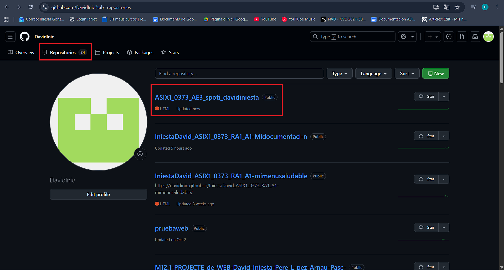

2. Una vez dentro del repositorio, iremos a settings.

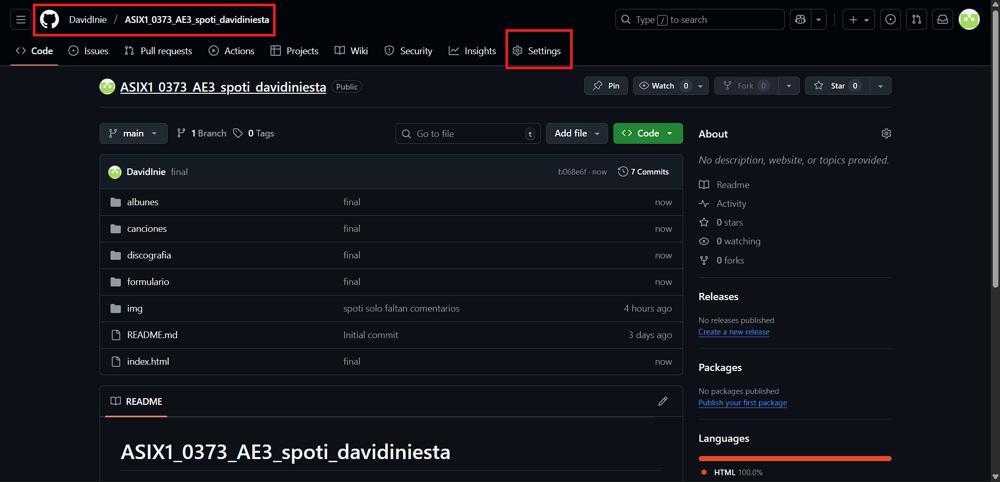

3. Cuando estemos dentro de settings, iremos a la parte izquierda y entraremos a PAGES.

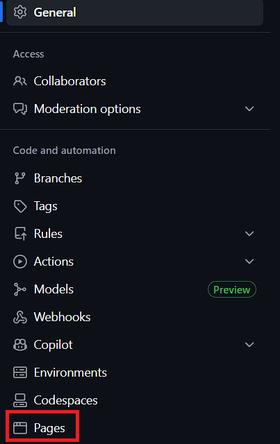

4. Cuando entremos, veremos que pone none.

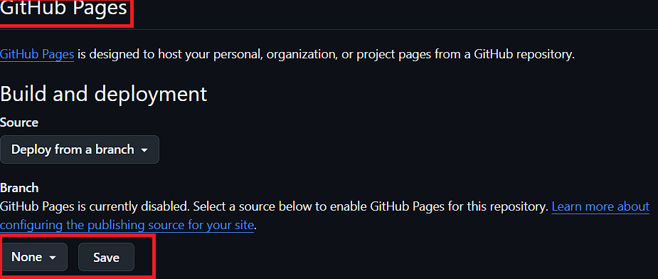

5. En la parte que pone none, tendremos que darle encima y poner save y darle a save.

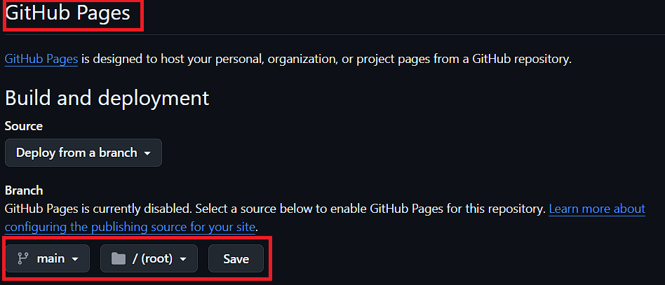

6. Una vez cambiada la ruta, esperaremos unos minutos y ya tendremos hecho el pages.


# Etiquetas básicas de Markdown


## Encabezados Markdown
- __Encabezados:__ Llevan un estilo asociado y cada uno sirve para iniciar el documento: Para hacer un encabazado en Markdown, utilizaremos la etiqueta (#).


# Esto es un encabezado H1
## Esto es un encabezado H2
### Esto es un encabezado H3
#### Esto es un encabezado H4
##### Esto es un encabezado H5
###### Esto es un encabezado H6


## Estilos Markdown
- En Markdown para poner estilos de letra utilizaremos:
    - Esto esta  __en negrtia__
    - Esto esta **en negrita**
    - Esto esta en _curiva_
    - Esto esta en *cursiva* 
- Para juntar los dos estilos utilizaremos los dos comandos, los combinaremos:
    - Esto esta en __*cursiva y negrita*__


## Listas Markdown
- Para hacer una lista ordenada utilizaremos, (1. 2. 3.)
Lista ordenada:
1. Elemento 1
2. Elemento 2
3. Elemnto 3


Lista desordenada: Para hacer lista desordenada utilizaremos (*) pero tambien podemos utilizar __+__ y __-__ para hacer una lista desorndenada.
* Elemento desordenado 1
* Elemento desordenado 2
* Elemento desordenado 3


Tambien podemos hacer un anexado para hacer una lista ordenada y una desordenada.
1. Elemento 1
    * Elemento desordenado 1.1
    * Elemento desordenado 1.2
2. Elemento 2
    * Elemento desordenado 2.1
    * Elemento desordenado 2.2
3. Elemento 3


## Parrafos Markdown
__##Para hacer parrafos le tendremos que dar 2 veces al intro.__

*Hola como estas:* Esto sera un parrafo.


*Bien y tu:* Se ha hecho un parrafo.


## Incluir HTML Markdown
__Los acentos para la izquierda, sirven para ver la etiqueta, esto lo utilizaremos para poner una etiqueta HTML.__

```html
    <p>esto sera un parrafo</p>
```

## Enlace Markdown
__Para poner un link utilizaremos la etiqueta:__

1. __Código enlace:__

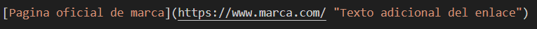

[Pagina oficial de marca](https://www.marca.com/ "Texto adicional del enlace")   


## Imagen Markdown

__Para poner una imagen utilizaremos la estiqueta:__ Aqui lo mas importante, es tener la imagen en una carpeta dentro del repositorio que hemos creado. Cuando hayamos hecho eso tendremos que poner la ruta relativa.
1. __Código imagen:__

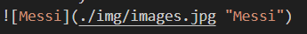


## Tabla Markdown
__Para hacer una tabla__ Utilizaremos las barras(||), |-----------| Esto lo utilizaremos para darle el ancho a la tabla.

1. __Código tabla:__

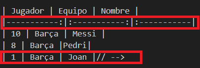

2. __Resultado tabla:__

| Jugador | Equipo | Nombre |
|-----------:|:-----------:|:-----------|
| 10 | Barça | Messi |
| 8 | Barça |Pedri|
| 1 | Barça | Joan |// -->


# Etiquetas básicas de HTML


- En HTML las etiquetas tienes que abrirse u cerrarse. Abrir etiqueta (<>), para cerrar una etiqueta utilizarems (/), (</>)


## Estructura basica HTML

- La estructura basica de HTML se empieza abriendo una etiqueta (!DOCTYPE html) cuando hayamos abirto la etiqueta, abriremos otra en la que tendremos que poner el lenguaje que queremos que tenga la pagina. (html lang="en"), despues de eso tendremos que abir y cerrar la etiqueta de (head). Sirve para añadir información extra, aqui dentro tendremos que poner los enlaces a otra pagina como a CSS o tambien podemos poner el favicon.


```html
    <!DOCTYPE html>
    <html lang="en">
    <head>
        <meta charset="UTF-8">
        <meta name="viewport" content="width=device-width, initial-scale=1.0">
        <title>Prueba</title>
        <link rel="stylesheet" href="style.css">
    </head>
```


## Normas básicas de HTML:


- Las etiquetas HTML suelen venir en pares, con apertura y cierre (por ejemplo, p).


- Algunas son etiquetas vacías, es decir, no tienen etiqueta de cierre, como ( img, br o input).


- Las etiquetas deben anidarse correctamente: si una etiqueta se abre dentro de otra, debe cerrarse antes de que se cierre la anterior.


- Los atributos se colocan en la etiqueta de apertura y tienen el formato nombre="valor".


- Recomendación: aunque HTML no distingue entre mayúsculas y minúsculas, se aconseja escribir todo en minúsculas.


## Legibilidad y organización del código


La legibilidad del código es la claridad con la que está escrito, para que cualquier persona pueda entenderlo fácilmente.  
**Es fundamental que el código HTML sea legible.**


Normalmente no trabajaremos solos, por lo que el código debe ser comprensible también para otros.  
Incluso si solo lo modificamos nosotros, la legibilidad ayuda a recordar lo que hemos hecho.


**La organización del código fuente** implica estructurar la aplicación en varios archivos y clasificarlos en los directorios necesarios.


**Técnicas para mejorar la legibilidad y organización:**
- Uso de comentarios.
- Indentación del código.
- Buena organización de los archivos.


## Comentarios en HTML.
- Los comentarios sirven para añadir anotaciones en el código que no se muestran en la página web, pero ayudan al desarrollador.
- Los comentarios se hacen:
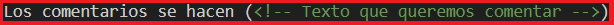
- Se recomienda comentar el código, si el codigo es largo, para hacerlo más comprensible, y para hacerlo mas entendible para otras personas.


## Encabezados HTML
- __Encabezados:__ Llevan una estiqueta asociada y casa uno sirve para iniciar el documento: Para hacer un encabazado en HTML, utilizaremos la etiqueta (h1, h2, h3, h4, h5, h6).


```html
    <h1>Esto  en un encabezado H1</h1>
    <h2>Esto  en un encabezado H2</h2>
    <h3>Esto  en un encabezado H3</h3>
    <h4>Esto  en un encabezado H4</h4>
    <h5>Esto  en un encabezado H5</h5>
    <h6>Esto  en un encabezado H6</h6>
```
1. __Código encabezado:__

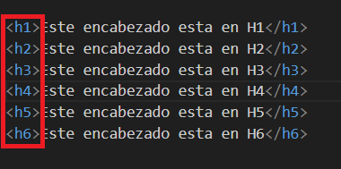

2. __Resultado encabezado:__

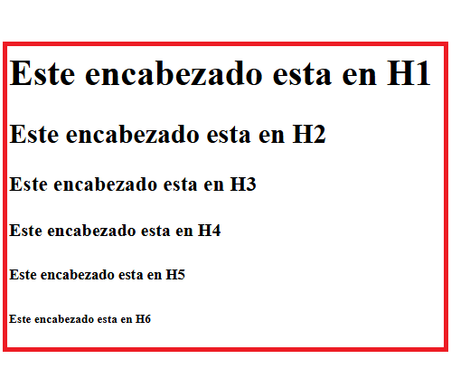

## Párrafos:
- Los párrafos sirven para agrupar oraciones relacionadas. Para hacer párrafos utilizaremos la etiqueta (p).

```html
    <p>Párrafo 1</p>
    <p>Párrafo 2</p>
```

## Salto de Linea:
- Un salto de linea sirve para mandar el texto, imagenes a la siguiente linea. Esto lo haremos con la etiqueta (br).
```html
    <h4>Párrafo 1</h4>
    <br>
    <h5>Párrafo 2</h5>
```
1. __Sin br__

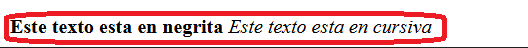

2. __Código br__

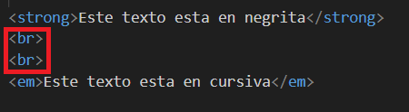

3. __Con br__ 

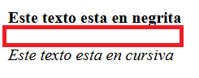


## Separador de línea: 
- Dibuja una línea divisoria. En la página. Esto lo haremos con etiqueta (hr).

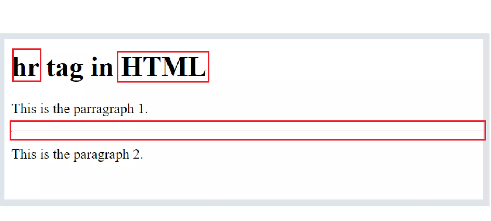


## Contenedor en linea: 
- Agrupa texto dentro de una línea sin crear un bloque nuevo. Esto lo haremos con la etiqueta (span).

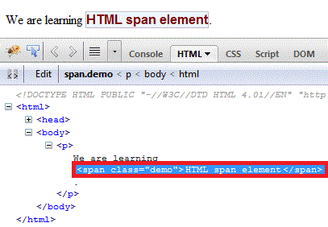


## Estilos HTML:
- Para poner estilos en HTML, utlizaremos las etiquetas:
* __strong__
* __em__

```html
    <strong>Se utiliza (strong) para poner negregita el texto</strong>
    <br>
    <em>Se utiliza (em) para poner curvisa el texto </em>
    <br>
    <p>Tambien podemos juntar los dos estilos</p>
    <br>
    <strong><em>Juntaremos las dos etiquetas para hacer un combinado de estilos</em></strong>
```

1. __Código negrita:__

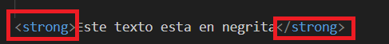

2. __Resultado negrita:__

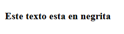

3. __Código cursiva:__


4. __Resultado cursiva:__

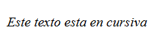


## Listas HTML: 

1. __Listas desordenadas:__ (ul): No tienen orden, usan viñetas.

    * __Codigo Lista Desordenada:__

    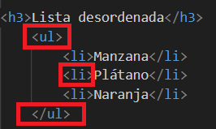

     * __Resultado Lista Desordenada:__

     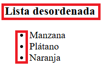

2. __Listas ordenadas:__ (ol) sí tienen orden, pueden usar números o letras. Cada punto de lista se define con (li).

    * __Codigo Lista Ordenada:__

    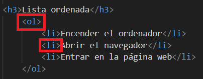

     * __Resultado Lista Ordenada:__

     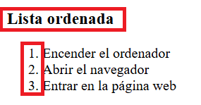

3. Estas listas las podemos combinar, haciendo un combinado de las etiquetas.

    * __Codigo Lista Combinada:__

    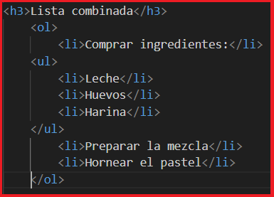

     * __Resultado Lista Combinada:__

     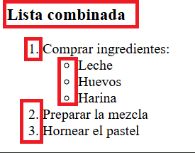


## Rutas HTML:

### Ruta Absoluta: 

- Muestra la dirección completa de un archivo.
     * __Ej:__ C:/Users/David/Documentos/ProyectoWeb/imagenes/logo.png

### Ruta Relativa: 

- Indica la ubicación del archivo respecto al documento actual.
    * __Ej:__ ../imagenes/logo.png

## Enlaces: 
- Se usan para conectar páginas o documentos.
- El destino se indica con el atributo href.
- Title sirve para poner el nombre al enlace.

### Enlaces paginas externas:

1. __Enlaces externos:__ llevan a otras webs.

    * __Enlace externo a Marca:__

     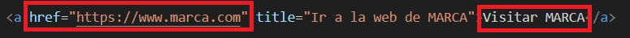

    * __Enlace desde la página:__

     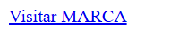

    * __Resultado Marca:__

     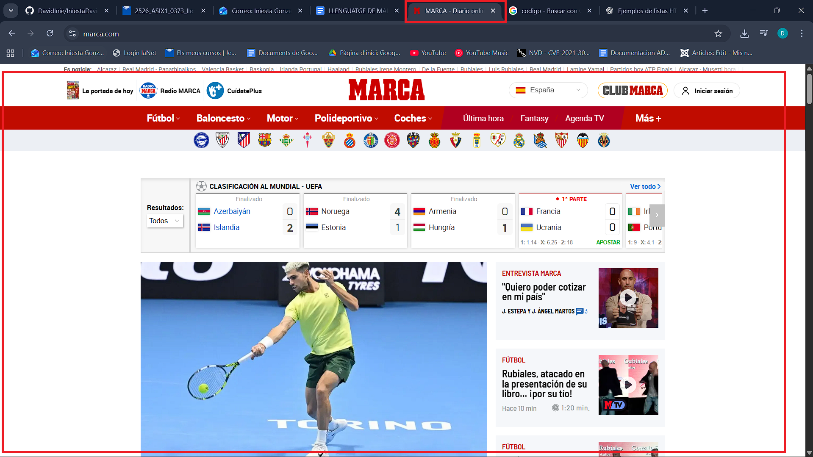

### Enlaces paginas internas o dentro del propio código HTml: 

2. __Enlaces locales:__ apuntan a archivos dentro del mismo sitio.

    * __Enlace local a otra pagina:__

     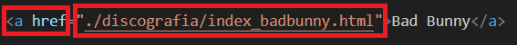

    * __Enlace desde la página:__

     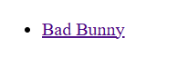

    * __Resultado desde la mismas página:__

     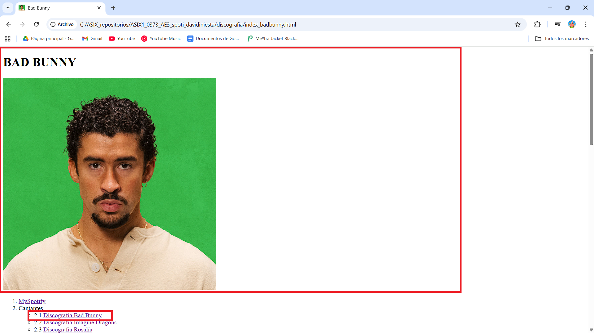


## Contenedores (DIV):
- (div) agrupa elementos y divide el contenido en secciones.
- Sirve para organizar, aplicar estilos CSS y trabajar con JavaScript.
- Es un bloque grande que puede contener texto, imágenes, formularios, etc.


## Elementos  sémanticos: 
- HTML semántico da significado al contenido.
- (div) y (span) no tienen significado propio, solo agrupan.
- Ejemplos de etiquetas semánticas: 
    * (header)
    * (footer)
    * (footer)
    * (section)
    * (nav)
    * (figure)

- Estas ayudan a los buscadores y a la accesibilidad web.

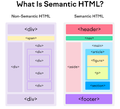


## Formularios:
- Para hacer formularios utilizaremos, las etiquetas: (imput): Se utiliza para crear diferentes campos para el formulario. Estos son los imput que podemos utilizar( text, password, radio, checkbox, email, file, number, range, search, tel, time, submit, reset, url). 

- Tambien tenemos las etiquetas (Select) y (option). Select: Se utiliza para crear menús desplegables y Option: Permite al usuario seleccionar una opción de una lista. 

- En estas dos etiquetas utilizaremos los atributos: 

* __name:__ Nombre del control que se usa al enviar el formulario.
* __id:__ Identificador único del elemento.
* __size:__ Número de opciones visibles sin desplazarse.
* __multiple:__ Permite seleccionar varias opciones a la vez.
* __value:__ Valor predeterminado del campo o valor enviado al servidor.

- Como ultima etiqueta de formulario tenemos <textarea>:

- Esta se utiliza para crear una área de texto para que los usuarios puedan poner texto. 

* __name:__ Nombre del control que se usa al enviar el formulario.
* __id:__ Identificador único del elemento; permite vincular etiquetas <label>.
* __rows:__ Número de líneas visibles (altura).
* __cols:__ Número de caracteres visibles por línea (ancho).
* __required:__ Campo obligatorio para enviar el formulario.
* __readonly:__ Campo solo de lectura (no editable).
* __disable:__ Campo desactivado (no interactivo).

1. __Código Formulario:__

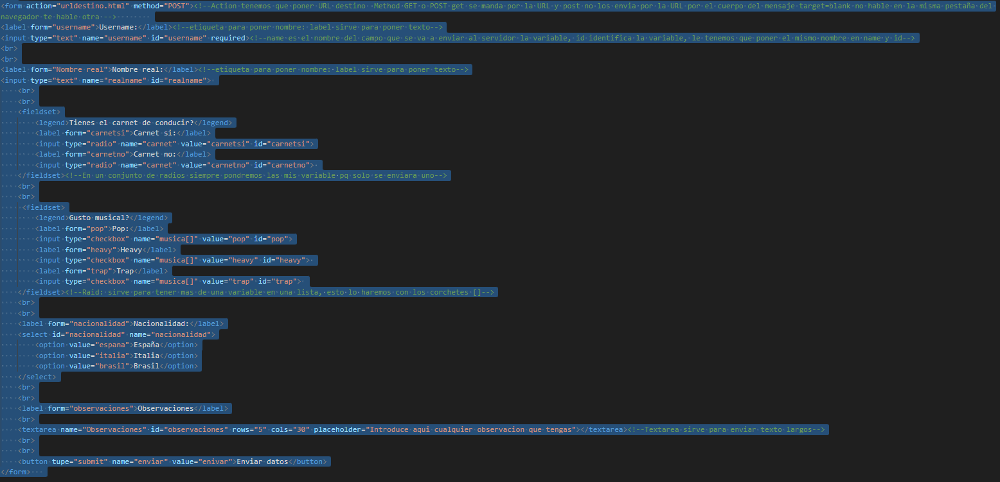

2. __Resultado Formulario:__

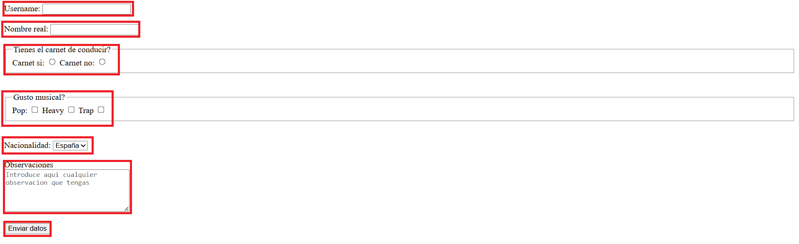


## Tablas:
- Las etiquetas de tablas son: 
1. __Table:__ Se utiliza para dar inicio a una tabla HTML. Esta etiqueta tiene atributos asociados. 
    * __Border:__ Define el grosor del borde de la tabla.
    * __Width:__ Sirve para poner el ancho de la tabla.
2. __thead:__ Agrupa el encabezado de la tabla, contiena la etiqueta (th).
3. __tbody:__ Agrupa el contenido importante de la tabla.
4. __tfooter:__ Agrupa el pie de la tabla, información final.
5. __caption:__ Sirve para poner texto debajo de la tabla
6. __tr:__ Fila de una tabla. Esta etiqueta tiene atributos asociados. 
    * __align:__ Alineación el contenido de una fila, alineación vertical. 
    * __bgcolor:__ Define el color del borde de la fila.
    * __valing:__ Alineación horizontal.
7. __th:__ Celda de encabezado de una tabla, "th" se muestra en negrita. Esta etiqueta tiene atributos asociados. 
    * __colspan:__  Define cuantas columnas abarca la celda.
    * __rowspan:__  Define cuantas filas abarca la celda. 
8. __td:__ Celda de datos dento de la fila de la tabla.  Esta etiqueta tiene atributos asociados. 
    * __align:__  Alinea el contenido dentro de la celda.
    * __colspan:__ Define cuantas columnas abarca la celda.
    * __rowspan:__ Define cuantas filas abarca la celda.

1. __Código tabla:__

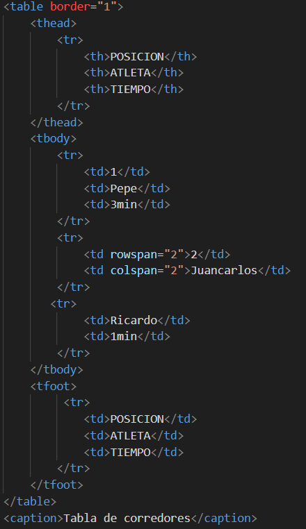

2. __Resultado tabla:__

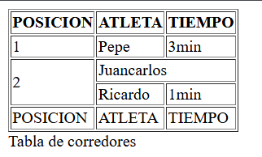

# Validar código HTML:

- La validación HTML sirve para comprobar que el código cumple con los estándares del W3C (World Wide Web Consortium).

- Ayuda a detectar y corregir errores que pueden causar fallos o diferencias entre navegadores.

- El validador HTML del W3C es una herramienta gratuita en línea que permite revisar el código.

- Se puede validar de tres formas:

    * Pegando la URL del sitio web,

    * Subiendo un archivo HTML,

    * Pegando directamente el código en el validador.

[Pagina oficial W3C](https://validator.w3.org/ "Pagina oficial W3C")

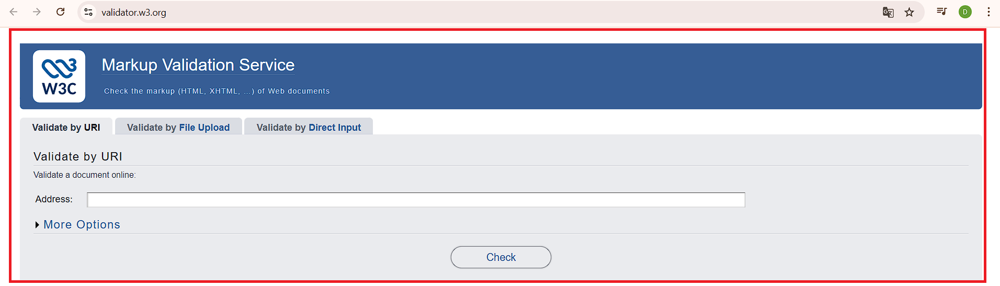
